# Background
Heart disease is dangerous and responsible for many deaths every year. It describes any condition that affects the heart, leading to complications, such as heart failure, heart attack, and stroke. Many risk factors contribute to the development of heart diseases, such as age, smoking, and obesity. Tests and exams are performed to diagnose the disease, which includes exercise or stress tests and electrocardiograms. Motivated by this fact, the task tried to integrate machine learning research with Public Health Dataset to assist in the identification of the most influential factors or exams that help in heart disease diagnosis. It explored the anonymized dataset of Cleveland, Hungary, Switzerland, and Long Beach V from 1988. Simultaneously, it investigated if ML models may assist doctors in the diagnosis by providing a list of patients that may need more investigation. Finally, the task decided to do a few experiments. Initially, it applied clustering analysis to investigate some patterns and identify patient groups. Finally, it built two different models, one using the decision tree classifier and another using Naïve Bayes to classify the patients that may have heart disease assisting the doctors in the analysis.

# Heart Disease Dataset
The heart disease data is from [Kaggle](https://www.kaggle.com/datasets/johnsmith88/heart-disease-dataset).

# Data Description
This dataset contains professional medical terminology and descriptions sourced from the UCI Machine Learning Repository and Kaggle's database. It encompasses various features and target variables, each providing essential information for medical analysis. 
 According to the primary data sourced from the UCI Machine Learning Repository [[1](#1)] and the Kaggle database utilized in this study, comprehensive data descriptions encompassing features and target variables have been provided.

* Age – age in years
* Sex – (1 = male, 0 = female)
* Cp – chest pain type (0 = typical angina, 1 = atypical angina, 2 =
Non-anginal, 3 = asymptomatic )
* Trestbps – resting blood pressure (in mm Hg on admission to the
hospital)
* Chol – serum cholestoral in mg/dl
* Fbs – (fasting blood sugar > 120 mg/dl) (1 = true, 0 = false)
* Restecg – resting electrocardiographic results (0 = normal, 1 = having ST-T wave abnormality, 2 = showing probable or definite left ventricular hypertrophy by Estes' criteria)
* Thalach – maximum heart rate achieved
* Exang – exercise induced angina (1 = yes, 0 = no)
* Oldpeak – ST depression induced by exercise relative to rest
* Slope – the slope of the peak exercise ST segment (0 = upsloping, 1 = flat, 2 = downsloping)
* Ca – number of major vessels (0-3) colored by flourosopy
* Thal – (1 = normal; 2 = fixed defect; 3 = reversable defect)
* Target – (0 = no disease, 1 = disease)

# Preprocessing and Analysis of the data
## Target Data Checking

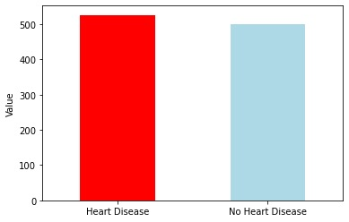

The bar chart and corresponding calculations reveal that 526 individuals exhibit the presence of heart disease, accounting for approximately 51.32% of the dataset, while 499 individuals exhibit an absence of heart disease, representing approximately 48.68% of the total. This indicates a balanced distribution within the target data.

## Analysis
### Feature relationship between variables

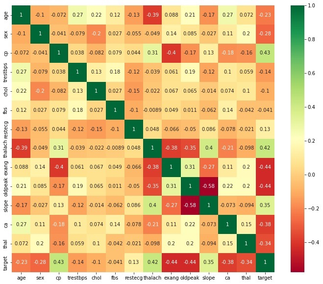

From the heatmap analysis, the following observations can be made:

1. Variables such as Oldpeak, exang, thalach, and cp, with coefficient exceeding 0.4, exhibit a strong and significant correlation with the presence of heart disease.

2. Features including thal, ca, slope, age, and sex, with coefficient falling within the range of 0.2 to 0.4, display a moderate and notable association with heart disease.

3. Variables trestbps, chol, fbs, and restecg, characterized by coefficient below 0.2, demonstrate a relatively weak correlation with heart disease.

4. Notably, the feature Oldpeak is strongly correlated with slope, as are thalach with age, and cp with exang, revealing interesting interrelationships among these variables.

### Visualiztion
Relationship between heart disease and oldpeak

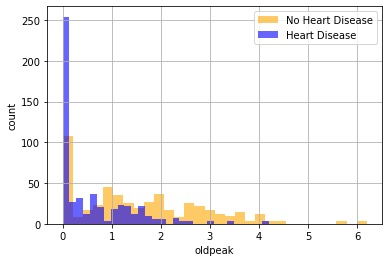

It's evident from the data that as "oldpeak" values increase, the individuals with heart disease decreases, and almost disappear when "oldpeak" reaches 4. Most individuals with heart disease are concentrated within the range of "oldpeak" from 0 to 3.

Relationship between oldpeak and slope

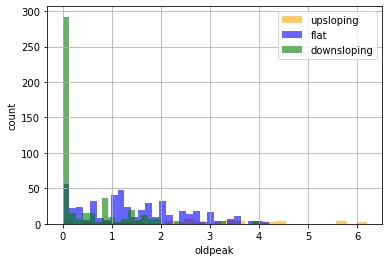

The concentration of individuals with downsloping and flat can be observed within the oldpeak range of 1 to 3.

The two charts depict that individuals with an oldpeak value near 0.1 and a downsloping slope have the highest incidence of heart disease among the studied population.

Relationship between exang and heart disease

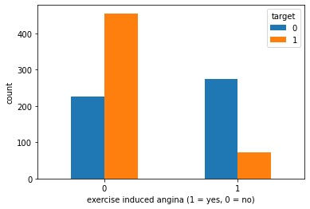

The results indicate that angina induced by exercise is associated with a lower probability of a heart disease diagnosis compared to non-exercise-induced angina. Therefore, when evaluating cases of exercise-induced angina, healthcare providers should consider additional factors or potential alternative diagnoses.

Relationship between exang and cp

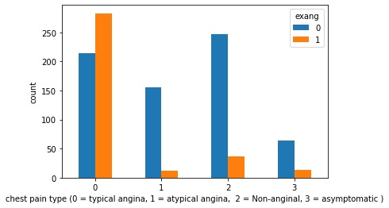

The results indicate that within the categories of chest pain types, the majority of cases classified as typical angina are associated with exercise-induced angina. In contrast, the remaining types of chest pain are more likely to have causes unrelated to exercise.

Relationship between cp and heart disease

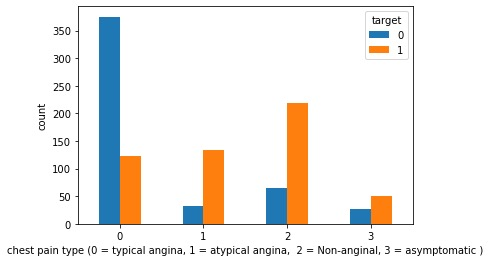

The bar chart illustrates a notable correlation between chest pain types and the likelihood of heart disease. It indicates that individuals with chest pain type of typical angina are less predisposed to heart disease, whereas those with other types of chest pain (ranging from 1 to 3) exhibit a higher probability of heart disease. This observation suggests a discernible relationship between chest pain types and the presence of heart disease. Consequently, it provides additional insights supporting the earlier conclusion that exercise-induced angina is less frequently associated with a heart disease diagnosis.

Relationship between thalach and age and heart disease

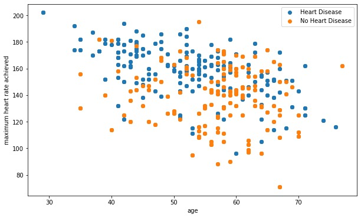

The chart illustrates that as age increases, there is a corresponding decrease in maximum heart rate. Notably, individuals between the ages of 40 and 60 show a higher likelihood of heart disease. Additionally, there are more cases of heart disease among those aged 30 to 40 than among those without heart disease in the same age group, indicating a trend of heart disease affecting a younger population. On average, individuals with heart disease exhibit a higher maximum heart rate.

Relationship between sex and heart disease

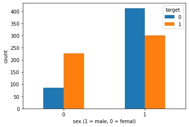

The chart illustrates a higher prevalence of heart disease among women compared to men.

Relationship between ca and heart disease

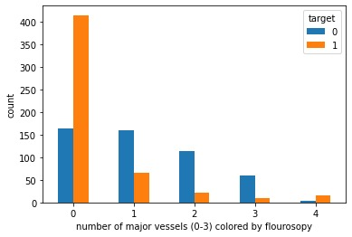

The chart demonstrates an increased occurrence of heart disease in individuals with zero major vessels colored by fluoroscopy.

relationship between thal and heart disease

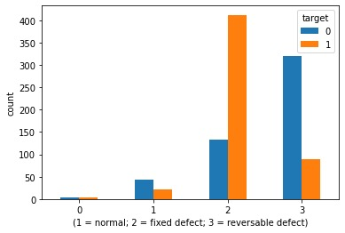

Thalassemia is an inherited (i.e., passed from parents to children through
genes) blood disorder caused when the body doesn’t make enough of a
protein called hemoglobin, an important part of red blood cells [[2]](#2).

The chart illustrates a notable trend where individuals with heart disease outnumber those without it when their thalassemia type is categorized as the second type. This suggests a potential association between this blood disorder and the occurrence of heart disease.

## Clusters Evaluation
### Feature Selection

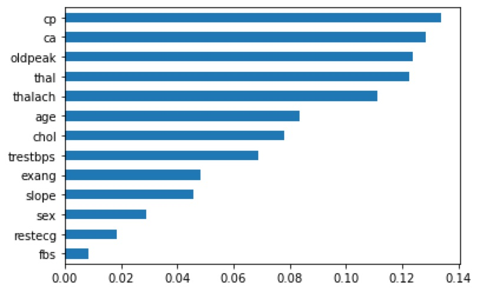

The dataset was partitioned into two subsets using a threshold of 10, resulting in a categorical set and a numeric set. The categorical set comprises the features 'sex,' 'cp,' 'fbs,' 'restecg,' 'exang,' 'slope,' 'ca,' 'thal,' and 'target,' while the numeric set includes 'age,' 'trestbps,' 'chol,' 'thalach,' and 'oldpeak.' Given the prevalence of categorized features, the feature selection process was executed utilizing the RandomForestClassifier model. This selection yielded five most significant features: 'cp,' 'ca,' 'oldpeak,' 'thal,' and 'thalach.' Subsequently, one-hot encoding was applied to the categorical features 'cp,' 'ca,' and 'thal.'

### K-Means 
Apply the K-means clustering method to derive patient profiles from the dataset, excluding labels. To assess the quality of the clusters, utilize the silhouette measure to choose the optimal number of clusters (k) that maximizes the silhouette score for the dataset.

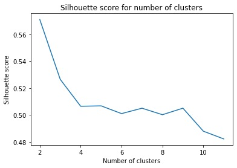

The results indicate that as the value of "k" increases, the silhouette score exhibits a general decreasing trend. The highest silhouette score, approximately 0.57, is achieved when "k" equals 2. 

### Illustrate the clusters in a 2D dimension using PCA

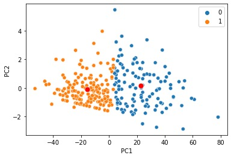

### Rand Index
Rand Index of 0.57687 indicates that there is some level of agreement between the predicted results of the cluster and the labels given in the dataset, but it is not a perfect match. The value is greater than 0.5, which implies that there is more similarity than dissimilarity.

## Compare the models Naïve bayes (NB) and Decision tree (DT) 

The analysis reveals that the Naive Bayes model achieves an accuracy of approximately 0.81493 and the Decision Tree model exhibits comparable performance, with an accuracy of 0.80519. 

The confusion matrix illustrates 118 correct predictions of heart disease, 41 false predictions of no heart disease when the patients have heart disease, 16 false predictions of heart disease when they have no heart disease, and 133 correct predictions of no heart disease. The confusion matrix for the Decision Tree model shows 116 correct predictions of heart disease, 43 false predictions of heart disease, 17 false predictions of no disease when patients have heart disease, and 132 correct predictions of no heart disease. Evaluation metrics such as accuracy, precision, recall, and f1-score, along with the ROC curve, are used to assess the models, providing insights into their predictive capabilities. The Naive Bayes model outperforms the Decision Tree model slightly, possibly because the Naive Bayes model is less affected by feature correlations due to its independence assumption.

Additionally, McNemar's test reveals no statistically significant difference in model performance, as the p-value exceeds 0.5, failing to reject the null hypothesis. This suggests that both models perform similarly in predicting heart disease.

# References
<a id="1">[1]</a>
R. Detrano, A. Jánosi, W. Steinbrunn, M. Pfisterer, J. Schmid, at al. (1989). "Heart Disease". *Published in American Journal of Cardiology* [Online]. Available: https://archive.ics.uci.edu/dataset/45/heart+disease. [Accessed Oct. 26, 2022].

<a id="2">[2]</a>
*What is thalassemia?*, Centers for Disease Control and Prevention, Apr. 2023, Available: https://www.cdc.gov/ncbddd/thalassemia/facts.html. [Accessed Oct. 26, 2022]. 