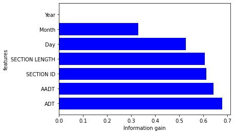
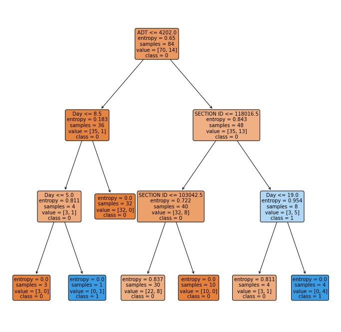
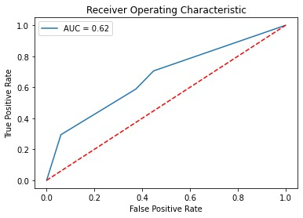
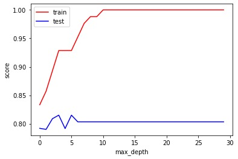
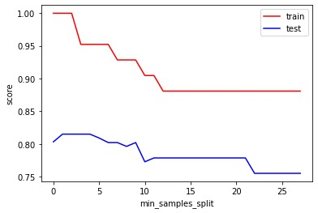
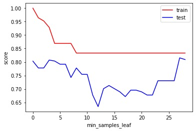

# Background

We all are responsible for taking care of our air. Nova Scotia Environment (NSE) strives to monitor and protect our outdoor air quality through regulations and programs to reduce pollutants that lead to issues like smog, acid rain, climate change, and the thinning ozone layer. Poor air quality can affect our health, lead to increased health care costs, and also affect natural resources. Motivated by this fact, the task tried to integrate machine learning research with air pollution epidemiology to support our environment. It mainly focused on the pollutant ‘ambient fine particulate matter (PM2.5)’, monitored and measured by the air quality station ‘Halifax’. it explored the Nova Scotia provincial ambient fine particulate matter (PM2.5) hourly data. PM2.5 is a common air pollutant that impacts the public health, causing heart and lungs problems. Simultaneously, the task investigated how the traffic flow contributes in the PM2.5 levels, and hence, the air quality. Finally, it decided to build the model using decision tree classifier to classify the average PM2.5 level. The task considered the class label as ‘High’ when the PM2.5 level ≥ 0.5 and ‘Low’ if PM2.5 level < 0.5.

# Dataset
The hourly ambient fine particulate matter (PM2.5) data is collected from:

https://data.novascotia.ca/Environment-and-Energy/Nova-Scotia-Provincial-Ambient-Fine-Particulate-Ma/ddk3-mz42

The traffic volume data is collected from:

https://data.novascotia.ca/Roads-Driving-and-Transport/Traffic-Volumes-Provincial-Highway-System/8524-ec3n

# Data Preporcessing
* Remove the irrelevant columns (Pollutant, Unit, Station, Instrument)  because these columns are almost the same for all the dates and average PM2.5.

* Identified 'Date' as the common feature connecting both datasets.

* Aggregated PM2.5 data by date, filtered for the year 2019 and Halifax, and merged the datasets.

* Normalized PM2.5 data based on a threshold of 0.5, creating a 'LEVEL' column.

* Dropped columns with minimal data (PRIORITY_POINTS, 85PCT, PTRUCKS) and redundant description columns.

* Addressed missing data by filling with appropriate methods (e.g., interpolation).

# Information Gain

The analysis of information gain highlights ADT as the primary determinant of PM2.5 levels, as it exhibits the highest information gain value among the considered features. The substantial information gain score of 0.678 indicates the significant influence of ADT on PM2.5 levels, underscoring its pivotal role in shaping the observed outcomes.

# Decision Tree
1. Fit the decision tree on 50% of the data and test it on 50% held out data. The accuracy is 

The leaf with sample equal to 1 is very small and can be indicative of overfitting.

* ROC

Then accuracy is about 0.81 for DecisionTreeClassifier model.

2. Apply 10-fold cross-validation technique and build  to classify PM2.5 level.

After applying 10-fold cross validation, the accuracy is about 0.8088 for DecisionTreeClassifier model.

# Variables max_depth, min_samples_split, and min_samples_leaf impact on model performance

model with different max_depth

As the max_depth hyperparameter increases, the disparity between the accuracy scores for the training and test datasets becomes more pronounced. Beyond a certain max_depth threshold, the training accuracy approaches unity, while the test accuracy plateaus.

model with min_samples_split

In the case of the min_samples_split parameter, larger values result in reduced accuracy scores for both the training and test datasets.

model with min_samples_leaf

as the min_samples_leaf parameter increases, the training accuracy exhibits a decreasing trend, while the test accuracy initially decreases, reaching its nadir between min_samples_leaf values of 10 and 15 before ascending.

It is evident from these observations that the model exhibits superior performance on the training dataset in comparison to the test dataset, as denoted by the consistently lower accuracy scores for the latter.