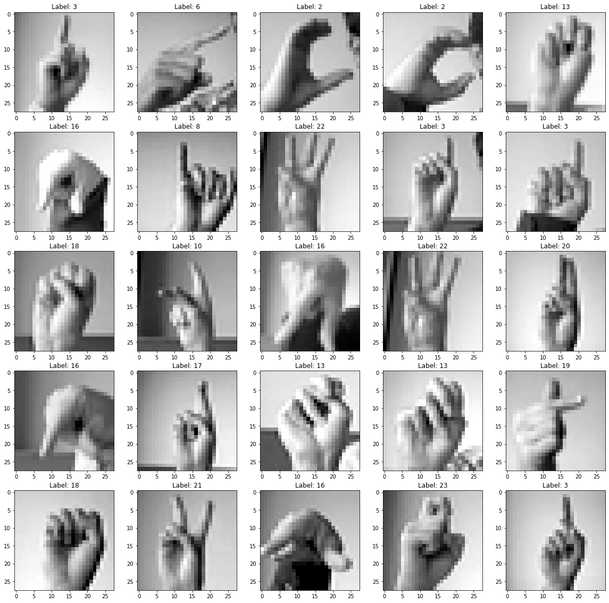
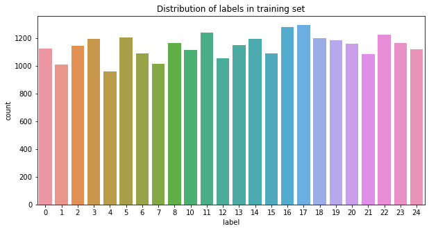
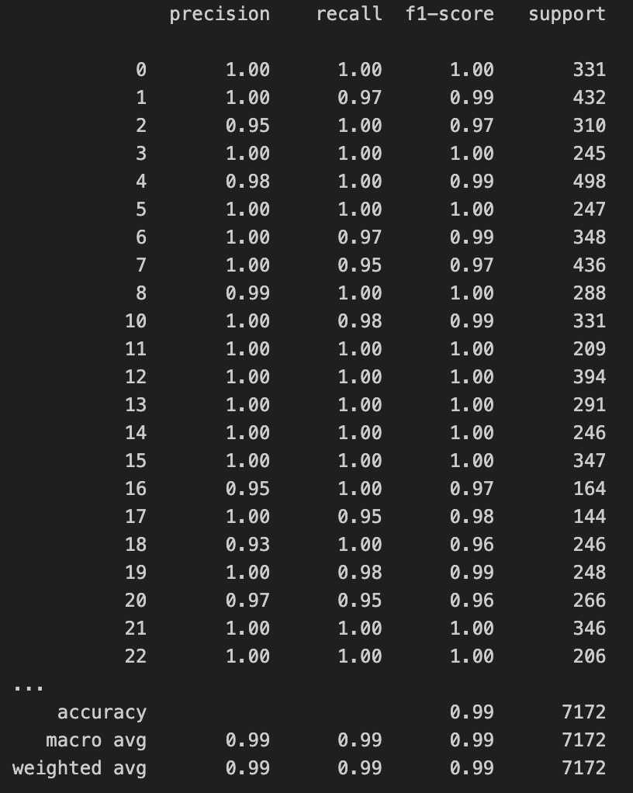

# Background
A vision system should be able to identify what are the main objects in the scene while navigating in an environment. Suppose that the client wants to create a chatbot that can communicate using sign language. For this system, one task that the chatbot should be able to accomplish is the recognition of the signs. Motivated by this task, the task tried to find a model that can recognize the hand sign and match them to the letter in the alphabet. Therefore, it did experiments on the Sign Language MNIST dataset, which contains images of hand signs and the respective alphabet letter. The task attempt to find a Convolution Neural Network model that is simple and still able to provide good precision in hand sign recognition. Finally, it decided to run a few experiments with different CNN architectures, parameters, and optimizers.

#  Sign Language MNIST dataset
The  Sign Language MNIST dataset is from [Kaggle](https://www.kaggle.com/datasets/datamunge/sign-language-mnist?resource=download).

# Data visualization
plot a section of grayscale images using the training set with their
corresponding label.

From the images, it can be seen that almost all the gestures are centered in
the image even though there is a small amount of them showing a little
displacement such as the second and third image in the second row. Also,
the third and fourth image in the first row have the same label 2.0, which
means they represent the same gesture while they are rotated at different
angles. Similarly, the fourth and fifth image in the second row have the
same label 3.0 but they are zoomed at different ranges. Then we could use
augmentation such as image shifting, rotation and zoom to increase the
dataset.

This is the distribution of the labels in the training set and testing set. The output shows that distribution of data is fairly balanced and there is no same number of images for each label.

# Data preprocessing

1. Use the `isna()` to detect if there are missing values in the training and testing dataset.
2. split labels as Y_train and Y_test, the left parts are X_train and X_test since the training set and testing set have one column for labels.
3. split 20% of the training set for the validation set. The validation set is used to evaluate the model when training, adjust hyperparameters and help to choose the best model. Here are 21964 cases for the training set, 5491 cases for the validation set and 7172 cases for the testing set.
4. Since the size of the image is 28x28, which means the image is 28 pixels in height and 28 pixels in width, and the decision is made to use grayscale images, then the channel is set to 1. Therefore, the image of the training set is reshaped to (21964, 28, 28, 1), indicating that there are 21,964 training images, with each image having a size of 28x28x1. The validation set has dimensions of (5491, 28, 28, 1).

# Data augmentation
To artific artificially increase the amount of data, initialize the generator to perform data augmentation. The configuration includes setting for centering and standardizing data, allowing random rotations within a range of ±10 degrees, random zooming within 10%, random horizontal and vertical shifts of 10%, and the choice of filling mode for areas outside the data boundaries. These generators apply the specified configurations to the datasets, facilitating batch-wise data flow to deep learning models for training and validation.

# Model Evaluation: Layer Configuration and Optimizer Parameter Tuning
The learning rate, responsible for the speed of model learning, determines the degree of error allocation used in weight updates, typically occurring at the end of each training batch. To optimize learning, a learning rate reducer is implemented before training commences, with monitoring based on 'val_accuracy' and a reduction factor of 0.5 after 2 patience epochs without improvement. EarlyStopping is set to monitor 'val_loss' with a maximum of 100 epochs. The loss function used 'sparse_categorical_crossentropy' due to multiple label classes. Evaluation metrics consist of accuracy and loss on both training and validation datasets, offering insights into training progression. Various model configurations involving different layer counts and orders are depicted in accompanying metric plots.

## Steps

1. Apply layers of CNN, pooling, and Fully-connected layers.
2. Conduct experiments by varying the number and the order of the layers, including adding and removing batch-normalization and dropout layers.
3. Continue experimentation by changing the optimizer and its parameters on the best model found, utilizing optimizers such as SGD, Adagrad, Adam, and RMSprop.

# Classification report 
The analysis of the classification report reveals that the precision for the majority of labels stands at 1.00, with exceptions noted for labels 2, 4, 8, 16, 18, 20, and 23. Furthermore, the accuracy rates for these labels consistently exceed 95%.

 