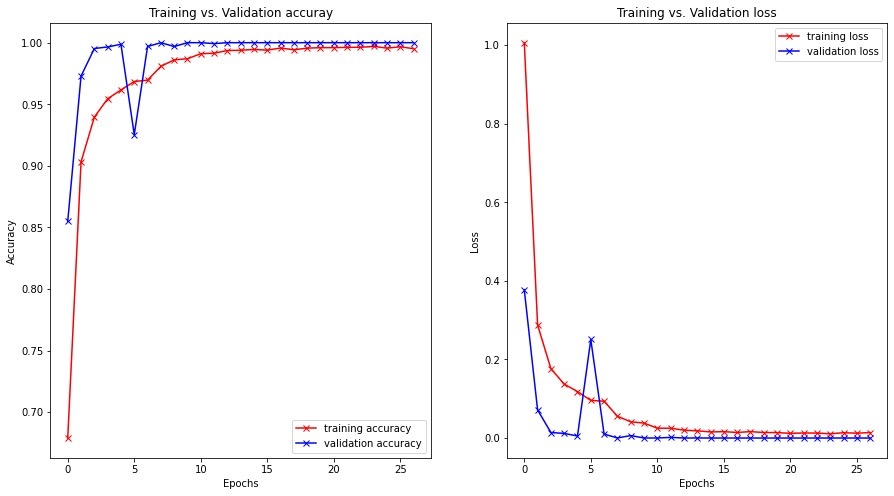

# Background
A vision system should be able to identify what are the main objects in the scene while navigating in an environment. Suppose that the client wants to create a chatbot that can communicate using sign language. For this system, one task that the chatbot should be able to accomplish is the recognition of the signs. Motivated by this task, the task tried to find a model that can recognize the hand sign and match them to the letter in the alphabet. Therefore, it did experiments on the Sign Language MNIST dataset, which contains images of hand signs and the respective alphabet letter. The task attempt to find a Convolution Neural Network model that is simple and still able to provide good precision in hand sign recognition. Finally, it decided to run a few experiments with different CNN architectures, parameters, and optimizers.

#  Sign Language MNIST dataset
The  Sign Language MNIST dataset is from [Kaggle](https://www.kaggle.com/datasets/datamunge/sign-language-mnist?resource=download).

# Data visualization
plot a section of grayscale images using the training set with their
corresponding label.

From the images, it can be seen that almost all the gestures are centered in
the image even though there is a small amount of them showing a little
displacement such as the second and third image in the second row. Also,
the third and fourth image in the first row have the same label 2.0, which
means they represent the same gesture while they are rotated at different
angles. Similarly, the fourth and fifth image in the second row have the
same label 3.0 but they are zoomed at different ranges. Then we could use
augmentation such as image shifting, rotation and zoom to increase the
dataset.

This is the distribution of the labels in the training set and testing set. The output shows that distribution of data is fairly balanced and there is no same number of images for each label.

# Data preprocessing

1. Use the `isna()` to detect if there are missing values in the training and testing dataset.
2. split labels as Y_train and Y_test, the left parts are X_train and X_test since the training set and testing set have one column for labels.
3. split 20% of the training set for the validation set. The validation set is used to evaluate the model when training, adjust hyperparameters and help to choose the best model. Here are 21964 cases for the training set, 5491 cases for the validation set and 7172 cases for the testing set.
4. Since the size of the image is 28x28, which means the image is 28 pixels in height and 28 pixels in width, and the decision is made to use grayscale images, then the channel is set to 1. Therefore, the image of the training set is reshaped to (21964, 28, 28, 1), indicating that there are 21,964 training images, with each image having a size of 28x28x1. The validation set has dimensions of (5491, 28, 28, 1).

# Data augmentation
To artific artificially increase the amount of data, initialize the generator to perform data augmentation. The configuration includes setting for centering and standardizing data, allowing random rotations within a range of ±10 degrees, random zooming within 10%, random horizontal and vertical shifts of 10%, and the choice of filling mode for areas outside the data boundaries. These generators apply the specified configurations to the datasets, facilitating batch-wise data flow to deep learning models for training and validation.

# Model Evaluation: Layer Configuration and Optimizer Parameter Tuning
The learning rate, responsible for the speed of model learning, determines the degree of error allocation used in weight updates, typically occurring at the end of each training batch. To optimize learning, a learning rate reducer is implemented before training commences, with monitoring based on 'val_accuracy' and a reduction factor of 0.5 after 2 patience epochs without improvement. EarlyStopping is set to monitor 'val_loss' with a maximum of 100 epochs. The loss function used 'sparse_categorical_crossentropy' due to multiple label classes. Evaluation metrics consist of accuracy and loss on both training and validation datasets, offering insights into training progression. Various model configurations involving different layer counts and orders are depicted in accompanying metric plots.

## Steps

1. Apply layers of CNN, pooling, and Fully-connected layers.
2. Conduct experiments by varying the number and the order of the layers, including adding and removing batch-normalization and dropout layers.
3. Continue experimentation by changing the optimizer and its parameters on the best model found, utilizing optimizers such as SGD, Adagrad, Adam, and RMSprop.

## Visualization
Model with 16 layers including 3 convolution layers and the activation is
Relu, 3 MaxPool2D layers, 2 fully-connected layers, 1 fatten layer, some
dropout layers and batch normalization.

Model without batch normalization.

Model without dropout layers.

Model with 8 layers of 2 convolution layers, 2 max pool layers, 1 fully-connected layer, 2 batch normalization and 1 flatten layer.

Model with 5 layers including 1 convolution layer, 1 max pooling layer, 1 batch normalization, 1 flatten layer and 1 fully-connected layer.

Model with different order of layers.

Model with optimizer Adagrad

The model's performance is not great because even after 100 training attempts (epochs), it still hasn't converged well. The accuracy on the training data is only 0.5236, and on the validation data, it's 0.7867. The loss (a measure of error) is 1.4573 for training and a high 30.9216 for validation. And the whole learning rate seems small,
especially on the training set. It can be seen that the start accuracy is very low and it requires more epochs to get flattened. The reason might be that even though the learning rate of the Adagrad optimizer will automatically adjust according to the different parameters and for the dense parameters the learning rate will be lower and the learning rate will be infinitely small in that an squared term will be added for each iteration.

Model with optimizer SGD

The performance metrics on the validation dataset consistently outperform those on the training dataset. This particular optimization technique exhibits superiority over Adagrad, achieving near convergence within 100 epochs. Notably, the learning rate undergoes a substantial reduction after the initial 20 epochs. This observation can be attributed to the inherent characteristics of Stochastic Gradient Descent (SGD), which updates the learning rate based on individual data samples, necessitating both forward and backward propagations with each update, which may exhibit a slower convergence rate.

Model with optimizer Adam

Adam demonstrates superior performance, not only in terms of its accuracy and loss metrics but also in its efficiency. Notably, it achieves convergence in a mere 32 epochs, leading to substantial savings in both memory and time when compared to Adagrad and SGD. While it requires slightly more epochs than RMSprop, Adam's rapid convergence within the initial 5 epochs is indicative of its effectiveness. This expeditious convergence is assumed to be attributed to Adam's utilization of both the gradient sum and the gradient squared sum, a strategy that accelerates the gradient descent process.

Model with optimizer RMSprop

The performance metrics of the RMSprop optimizer demonstrate close similarity to those of the Adam optimizer, notably with the advantage of converging in fewer training epochs. To make a selection between the two, I evaluate their prediction accuracy on the training dataset. The model trained with RMSprop yields an accuracy of 0.9804796430563302, while the model trained with Adam achieves a higher accuracy of 0.9881483547127718. Based on this evaluation, the Adam optimizer is deemed the preferred choice.

Model with optimizer Adam and learning rate 0.00001

It is evident that the convergence of accuracy and loss is hindered by the excessively small learning rate, rendering 100 epochs insufficient for achieving convergence.

Model with optimizer Adam and learning rate 0.0001

In this analysis, it is observed that as the learning rate increases, both the accuracy and loss metrics exhibit convergence. This phenomenon is indicative of a larger gradient descent step, which accelerates the convergence process, reducing the time required for model convergence.

Model with optimizer Adam and learning rate 0.01

The graphical representation illustrates a notable challenge in the convergence of accuracy and loss. This issue arises due to an excessively large learning rate, which, in turn, impedes the gradient descent algorithm from efficiently approaching the optimal solution. The consequence is a protracted convergence process and difficulty in reaching the desired optimum.

Schedule the learning rate by configuring the initial_learning_rate at 1e-3, decay steps at 10,000, and a decay rate of 0.9. This adjustment in the learning rate strategy was motivated by the observed trends discussed earlier.

# Classification report 
The analysis of the classification report reveals that the precision for the majority of labels stands at 1.00, with exceptions noted for labels 2, 4, 8, 16, 18, 20, and 23. Furthermore, the accuracy rates for these labels consistently exceed 95%.

 

The analysis of the classification report reveals that the precision values for the majority of labels are 1.00, indicating near-perfect precision, with the exceptions being labels 2, 4, 8, 16, 18, 20, and 23. Despite variations in precision, the accuracy of the model remains consistently high, surpassing 95% for these labels.